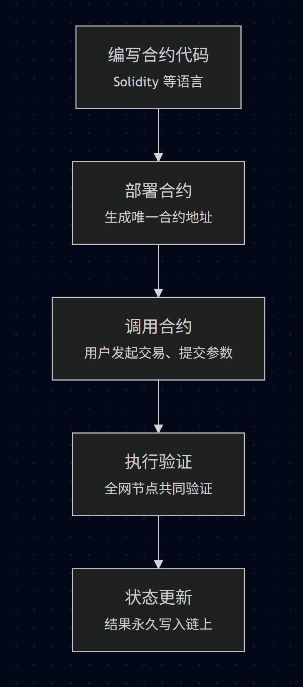

# 什么是智能合约？它到底能做什么？

## 智能合约的定义与核心特点
智能合约（Smart Contract）是运行在区块链上的自动化程序，类似“自执行的合同”，代码写好后，部署在区块链上，任何人都无法篡改和关闭它。只要满足预设条件，合约代码就会自动执行相应操作。

>简单理解： 就像自动贩卖机，投币后，机器自动检查币值、是否有货，并自动出货，没有人能“作弊”或“插手”。

智能合约的核心特点

| 特性   | 说明                         |
| ---- | -------------------------- |
| 不可篡改 | 合约一旦部署，代码永久写入区块链，任何人都不能修改  |
| 自动执行 | 预先设定好的条件一旦满足，合约自动运行，无需人工干预 |
| 去中心化 | 运行在分布式网络中，无单点控制或故障风险       |
| 公开透明 | 代码和执行记录全部公开，任何人都能查看        |
| 自主自治 | 无需第三方机构，合约自行完成资产管理和逻辑执行    |

## 智能合约的工作原理
智能合约本质是区块链上运行的代码。它包含了状态（State）和函数（Functions）。

> 状态：类似程序的变量，存储在链上，随操作更新, 函数：定义合约如何响应用户调用，实现具体逻辑



## 智能合约举例与代码示范
下面是一个简单的智能合约示例，记录并修改一句话：

```
pragma solidity ^0.8.0;

contract MessageContract {
    string public message;

    // 部署时初始化消息
    constructor(string memory initialMessage) {
        message = initialMessage;
    }

    // 修改消息
    function updateMessage(string memory newMessage) public {
        message = newMessage;
    }
}
```
- 部署合约时传入初始信息；
- 任何人都可以调用 updateMessage 更新内容；
- 所有变更会永久保存在链上。

## 智能合约的真实应用案例
### 1. 去中心化交易所 — Uniswap
- 用智能合约自动撮合买卖订单；
- 用户无须托管资产，直接在链上交易；
- 交易费自动分配给流动性提供者；
- 交易公开透明，无需信任中心化机构。

### 2. NFT 市场 — OpenSea
- 上架、购买、转让NFT都由合约控制；
- 确保所有权和交易历史不可篡改；
- 免第三方介入，自动结算版税。

### 3. 域名系统 — ENS（Ethereum Name Service）
- 以太坊地址映射成易记的域名，如 alice.eth；
- 域名注册、续费均由合约管理；
- 解决链上地址难记问题。

## 智能合约的优势
| 优势    | 具体表现                  |
| ----- | --------------------- |
| 自动化执行 | 规则写好后自动执行，无需人工审核      |
| 不可篡改  | 代码和数据上链后不可修改，保障合约执行安全 |
| 去中心化  | 无需信任第三方机构，降低中间人风险     |
| 公开透明  | 任何人可审计代码，执行过程全公开      |
| 跨地域   | 无国界限制，全球任何人均可访问和使用    |

## 智能合约的风险和挑战
| 风险类型    | 说明                        | 案例/备注                   |
| ------- | ------------------------- | ----------------------- |
| 代码漏洞    | 合约存在安全漏洞，可能导致资金被盗、锁定或丢失   | 2016年The DAO被攻击事件       |
| 无法修改    | 部署后无法轻易修复错误，必须提前做好测试和安全审计 | 设计升级代理合约模式（Proxy）解决部分问题 |
| 权限设计不当  | 权限设置不合理可能被滥用，如管理员私钥被盗     | 需设计多签、时锁等安全机制           |
| 用户操作风险  | 用户调用错误函数或交易参数失误导致资产损失     | 错发交易、误调用导致资产永久丢失        |
| 高昂Gas费用 | 复杂操作消耗大量 Gas，导致用户体验差      | 以太坊拥堵时交易费用暴涨            |
| 法律合规风险  | 不同国家监管政策不同，合约可能涉及法律责任     | 合规性审查与合规设计日渐重要          |

## 小结
智能合约是区块链去中心化应用的“发动机”，它通过代码自动执行协议条款，实现无需信任的业务逻辑管理。


