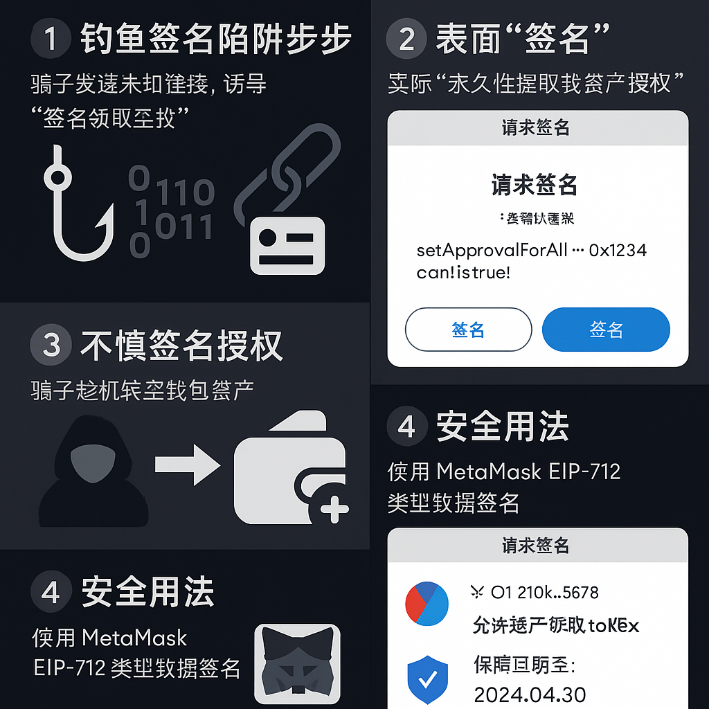

# 钱包安全详解
你不是在使用钱包，而是在管理自己的银行。

## 希望帮助你
帮助你了解如何正确备份钱包、保护助记词与私钥、识别钓鱼攻击、撤销危险授权，避免资产被盗。

##  1. 助记词、私钥、Keystore 是什么？

| 名称     | 描述                                                         |
| -------- | ------------------------------------------------------------ |
| 助记词   | 钱包自动生成的 12 或 24 个英文单词，便于备份，可用于恢复钱包   |
| 私钥     | 控制钱包的“钥匙”，用于签名、转账、交互，一旦泄露资产将丢失     |
| Keystore | 加密后的私钥文件，需密码解密，常用于导入钱包                   |

> ⚠️ 谁掌握你的私钥或助记词，谁就掌握了你的链上资产。

##  2. 助记词的正确备份方式

**推荐方式：**
- 抄写在纸质本子上，放在安全处（建议分开存放，防火防潮）
- 用金属助记词板刻字，防火防水（如 Cryptosteel）
- 分词备份法：将助记词分成两半，分别保管

**严禁操作：**
- ❌ 截图、拍照
- ❌ 存在手机、电脑、云盘、邮箱、微信等
- ❌ 发给他人代为保管（除非极度信任）

##  3. 常见钱包攻击场景与防范方法
|  场景             |  描述                                         |  防范建议                                                                                  |
|--------------------|------------------------------------------------|---------------------------------------------------------------------------------------------|
| 钓鱼网站           | 模仿官网或项目页面，诱导输入助记词/私钥         | - 只从项目官网或推特跳转 - 使用 Chainlist.org、etherscan 等官方跳转                      |
| 钓鱼签名           | 模仿空投/NFT 签名弹窗，实为“授权转移”操作       | - 签名前仔细查看内容：是否含 setApprovalForAll, permit, transferFrom - 使用支持 EIP-712 明文签名的钱包（如 Rabby） |
| 浏览器插件恶意注入 | 安装了伪装成 Web3 插件的钱包，窃取交易数据      | - 只从 Chrome 官方商店安装插件 - 定期检查插件来源与权限                                  |
| 公共 Wi-Fi         | 黑客监听你的交易流量，获取地址或签名数据        | - 尽量避免在公共 Wi-Fi 使用钱包 - 使用移动网络或加密 VPN                                  |
| 误装假钱包 App     | 安装假冒的 MetaMask、OKX 钱包，伪造界面窃密     | - 只从官网下载 App（官网 → App Store / Google Play） - 不轻信陌生链接传播的钱包安装包     |

##  4. 钓鱼签名详解（你不是在“转账”，而是在授权）

许多 DApp 会弹出签名请求，例如： 

- `signMessage`：普通信息签名
- `signTypedData`（EIP-712）：结构化授权，如允许某地址“无限提取你的代币”

> ⚠️ 用户常误以为没转账就没风险，实际上可能已授权合约无限制提取资产，恶意合约可趁未撤销授权时盗走资产。

##  5. 如何检查并撤销授权

**推荐工具：**
- [revoke.cash](https://revoke.cash)
- [Safe Global（多签）](https://app.safe.global)
- 浏览器钱包如 Rabby 可自动提示危险授权

##  6. 如何避免资产被盗？（实用建议）

| 场景           | 正确做法                                         |
| -------------- | ----------------------------------------------- |
| 创建钱包       | 当场抄写助记词，绝不截图                         |
| 访问 DApp      | 认准网址，别点来历不明的空投链接                 |
| 使用钱包签名   | 看清签名内容，提防“SetApprovalForAll” 类型授权   |
| 高价值资产（>$10k） | 使用 Ledger 冷钱包，避免频繁操作             |
| NFT 项目交互   | 创建独立钱包专用交互，避免主钱包暴露             |
| 导入钱包时     | 使用官方 App / 插件，不从搜索引擎点不明链接      |
| 手机使用钱包   | 禁用云同步、照片自动备份                         |

##  7. 安全分层建议（按资产大小分级管理）

| 资产规模           | 建议方案                                         |
| ------------------ | ----------------------------------------------- |
| < $500             | 热钱包即可，注意授权检查                        |
| $500 ~ $10,000     | 建议使用多个热钱包 + 分仓                        |
| > $10,000          | 使用 Ledger/Trezor 冷钱包 + 多重备份             |
| NFT 高价值收藏品   | 单独钱包 + 限权操作（只展示，不签名）           |

## ✅ 小结
- 钱包的“最大风险”不是技术 bug，<b>而是你自己不小心操作</b>

- 最安全的钱包也抵挡不住人为的误签和泄露

- 定期审查授权，是 Web3 生存的第一课