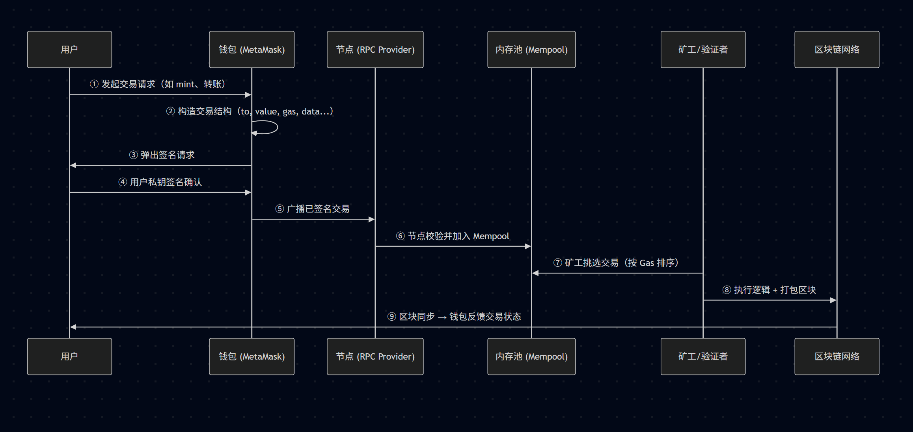

# Web3 基础概念详解（进阶版）
## 交易背后的执行机制（内存池、矿工打包、状态更新）

###  1. 整体流程概览




###  2. 内存池 Mempool 详解

**Mempool（内存池）** 是所有节点中暂存“尚未进入区块的交易”的缓冲区。它不是链上结构，而是节点的本地内存结构。

####  作用：

* 接收所有广播来的交易请求
* 为矿工/验证者提供“候选交易列表”
* 允许排序、筛选、优先处理高 gas 的交易
* 是 MEV Bot 实施抢跑（front-run）、夹击（sandwich）的必争之地

####  交易进入 Mempool 的条件：

* 签名合法（用私钥签名）
* nonce 合法（必须等于地址当前 nonce）
* 余额足够支付交易金额 + gas
* 没有冲突（nonce 重复、交易池中已有同 nonce）


###  3. 矿工打包逻辑

**矿工/验证者** 每隔一个出块周期（例如以太坊约 12 秒）将从 Mempool 中选出交易，打包进新区块。

####  排序依据：

* EIP-1559 模式下，交易总费用 = baseFee + priorityFee（小费）
* 谁给的 priorityFee 多，谁优先打包
* 可通过替换交易（replace-by-fee）机制更新

####  示例：

```plaintext
Mempool 排序：
1. Alice：gasPrice = 100 Gwei
2. Bob：gasPrice = 50 Gwei
3. Charlie：gasPrice = 30 Gwei
```

矿工会优先打包 Alice 的交易。


###  4. 状态更新机制

交易执行之后，不只是转账完成，更重要的是链上“状态”的变化。这一过程依赖 EVM 的内部存储机制：

#### 📚 状态树结构：

* 账户状态：余额、nonce、合约代码 hash
* 存储状态（合约变量）：用 Merkle Patricia Trie 管理
* 整体状态变化通过 `stateRoot` 哈希值标记，写入区块头中

####  举例：转账交易执行步骤

1. 扣除 sender 的 balance
2. 增加 receiver 的 balance
3. 记录交易日志 logs
4. 更新交易池 nonce（+1）
5. 状态树根节点 hash 变化（写入区块头）


###  5. 安全性保障机制

* 所有交易必须签名才能被接收进 Mempool（防篡改）
* 所有交易顺序由 nonce 控制（防重复执行）
* 所有状态变更写入状态树（可校验）
* 区块通过 PoW / PoS 共识机制生成，确保不可篡改性


###  6. 扩展：Mempool 与 MEV 的关系

* MEV（最大可提取价值）：通过控制交易排序，获得套利收益
* 常见 MEV 技术：前置交易（front-run）、夹击（sandwich）、清算机器人（liquidation bot）
* Flashbots：提供私有 Mempool，避免公开 Mempool 被监听


### ✅ 小结

| 阶段 | 内容              | 特征                     |
| -- | --------------- | ---------------------- |
| 发起 | 用户签名交易          | 签名防篡改，数据格式标准           |
| 暂存 | 节点将交易存入内存池      | gas 决定优先级，等待打包         |
| 打包 | 矿工/验证者挑选交易构建新区块 | 高 gas 优先，EIP-1559 改善拥堵 |
| 执行 | 执行交易代码，更新合约变量   | 状态树变更，记录日志             |
| 广播 | 全网同步区块，钱包接收通知   | 区块头包含状态 root，防回滚       |

