# MetaMask 使用操作全攻略
## 通过钱包发送链上交易的流程

首先，我们来了解一下如何通过钱包将交易发送到区块链，以及钱包与区块链之间的关联。

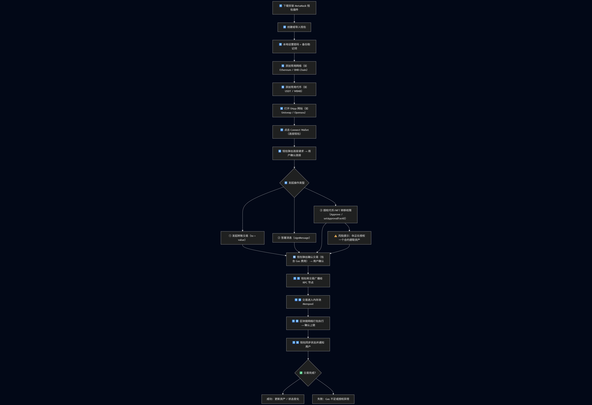

### 1. 准备阶段
- 安装 MetaMask 插件
- 创建或导入钱包
- 设置本地登录密码并备份助记词

### 2. 网络配置
- 添加常用网络（如 Ethereum、BNB Chain、Polygon）
- 添加常用代币（如 USDT、WBNB、DAI）

### 3. 与 DApp 交互
- 打开 DApp 网站（如 Uniswap、Opensea、Aave）
- 点击「Connect Wallet」（连接钱包）
- 钱包弹出连接授权窗口，用户确认连接

### 4. 发起操作
- 用户选择操作类型：
    - 转账交易
    - 签署消息（signMessage）
    - 授权操作（Approve / setApprovalForAll）

### 5. 确认与广播
- 钱包弹出确认窗口
- 若为授权类操作，会有特别提示

### 6. 链上处理
- 钱包将已签名交易广播至 RPC 节点
- 节点将交易送入 Mempool（交易池）等待打包
- 区块链矿工/验证者将其打包进新区块并执行

### 7. 结果反馈
- 钱包同步链上最新状态并通知用户

### 8. 交易结果判断
- **成功**：资产更新、NFT 到账、状态改变
- **失败**：可能因 Gas 不足、nonce 错误、合约异常等

> **钱包是区块链交互的入口，下面我们学习如何创建 MetaMask 钱包。**

## 创建 MetaMask 钱包

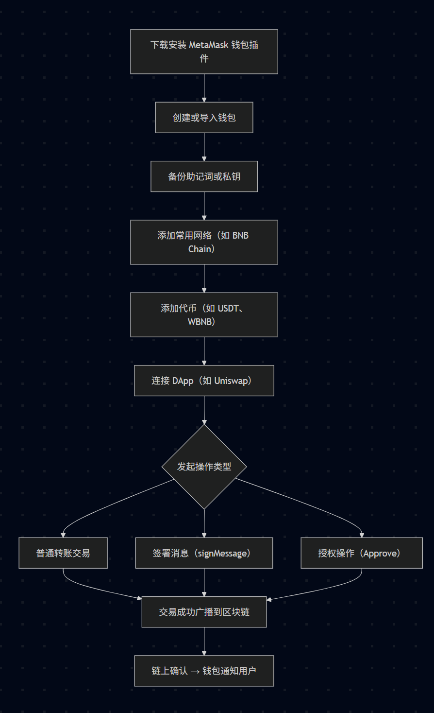

### 1. 安装 MetaMask 插件
- 推荐浏览器：Chrome、Brave、Edge
- 打开官网：https://metamask.io
- 点击「GET METAMASK」
- 选择「Chrome」→ 进入 Chrome 商店[https://chromewebstore.google.com/detail/metamask/nkbihfbeogaeaoehlefnkodbefgpgknn]
- 点击「添加至 Chrome」，安装插件
- 安装成功后浏览器右上角会出现 🦊 小狐狸图标 
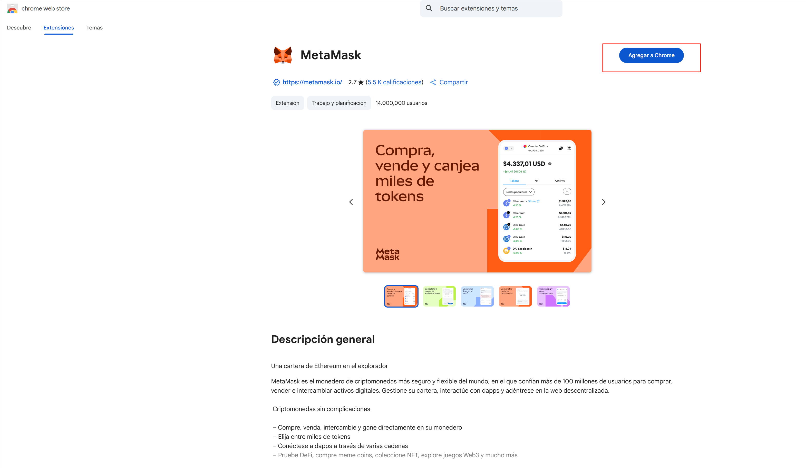

> ⚠️ **防钓鱼提醒**：务必从官网进入，不要通过百度或非官方广告页！

### 2. 创建或导入钱包
#### 创建新钱包
- 点击「Get Started」→「Create a Wallet」
- 设置本地登录密码（仅本地设备用，不是私钥）
- 备份助记词（12 个英文单词），务必手抄
- 确认助记词顺序
- 钱包创建完成，进入主界面 
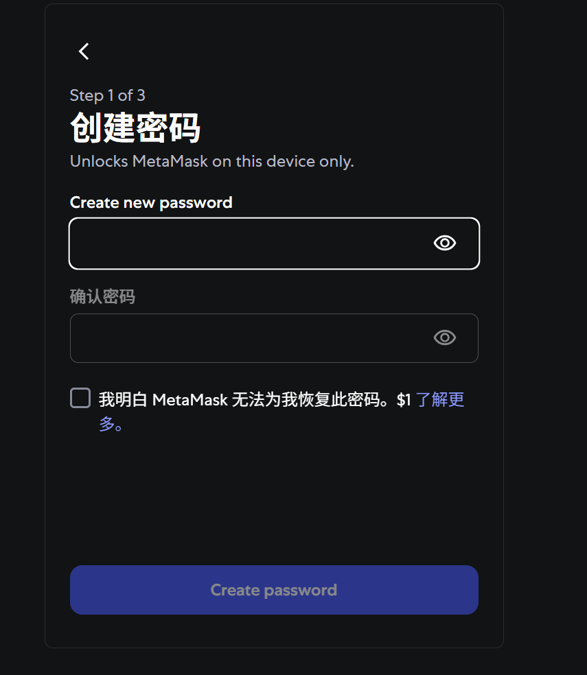
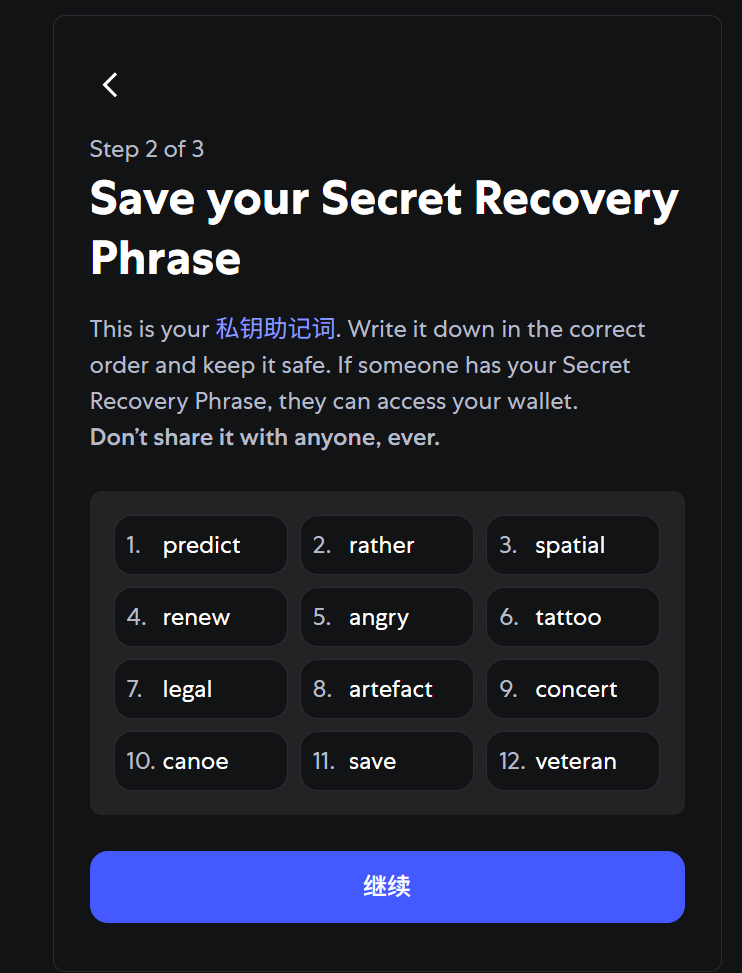
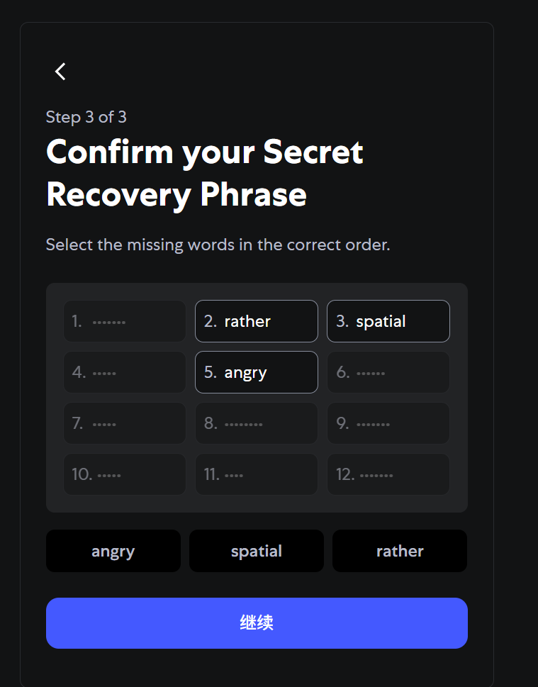

> **备份建议**：不截图、不存手机/邮箱/云盘，可用金属板或纸质抄写

#### 导入已有钱包
- 选择「Import Wallet」
- 输入 12 个助记词
- 设置新的本地密码
- 即可恢复钱包 
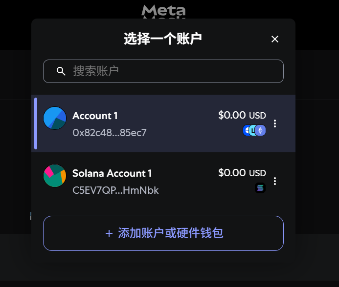
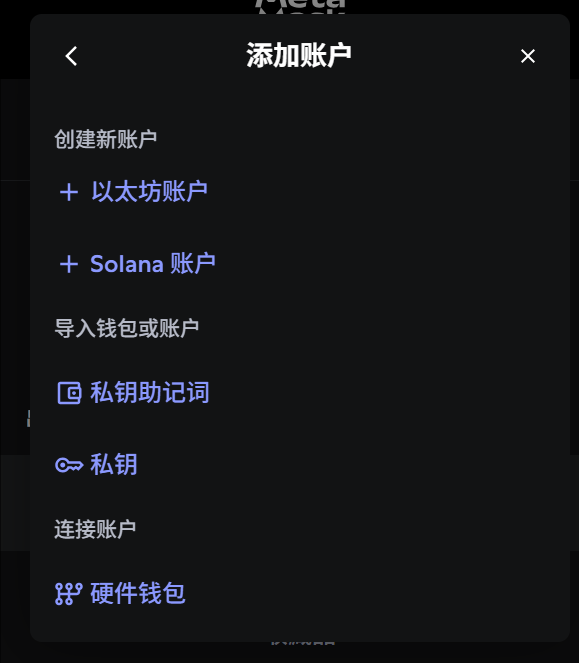
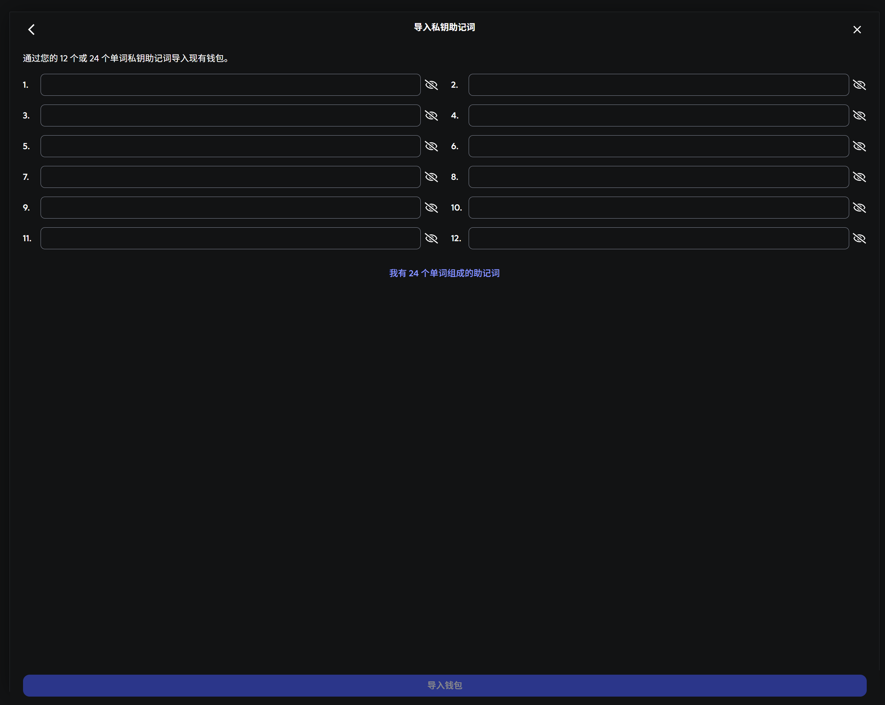

### 3. 添加常用公链网络
MetaMask 默认只支持 Ethereum 主网，其他链需手动添加或一键连接。

#### 手动添加（以 BNB Chain 为例）
- 点击右上角「网络下拉」→「Add network」
- 点击「Add a network manually」
- 填写如下信息：

| 字段 | BNB Chain 主网配置 |
| ---- | ------------------ |
| Network Name | BNB Chain |
| New RPC URL | https://bsc-dataseed.binance.org/ |
| Chain ID | 56 |
| Currency | BNB |
| Block Explorer | https://bscscan.com |

- 添加后即可在网络切换栏选择 BNB Chain 

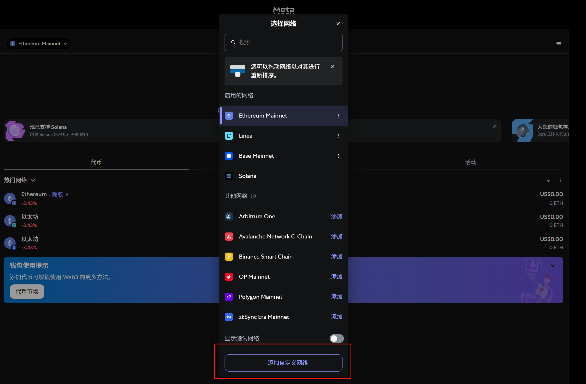
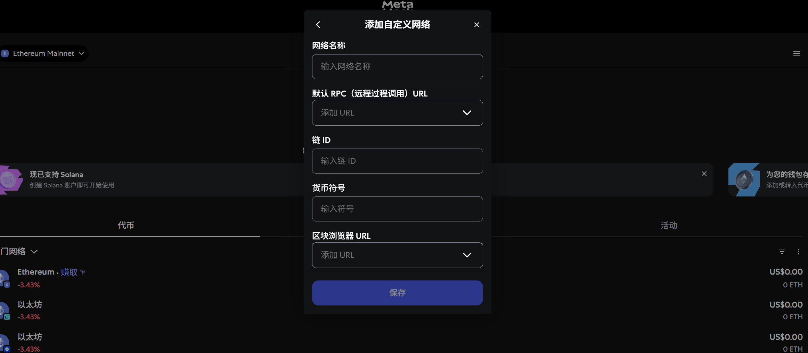

> **建议**：可用 https://chainlist.org 一键添加

### 4. 添加自定义代币（如 USDT、WBNB）
- 进入对应链（如 BSC）
- 点击「Assets」→ 下拉到底部「Import tokens」
- 粘贴代币合约地址（如 BSC 上 USDT 地址）
- MetaMask 自动识别名称、精度，点击「添加」 

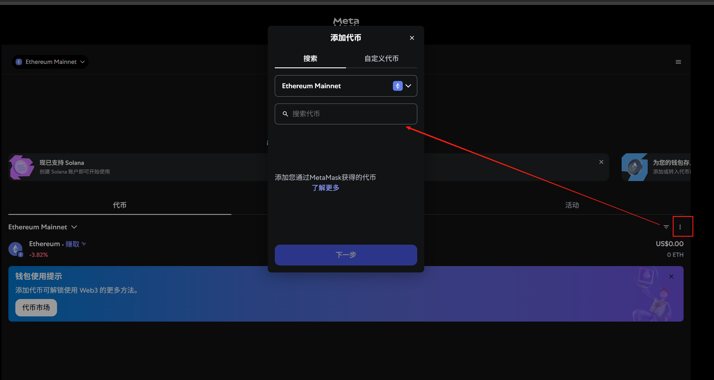

> **合约地址建议从 bscscan.com 或 etherscan.io 获取，避免不明链接！**

### 5. 连接 DApp（去中心化应用）
- 访问 DApp（如 https://app.uniswap.org )
- 页面提示「Connect Wallet」
- 点击连接 → 选择 MetaMask → 弹出签名窗口
- 确认后连接成功，常显示钱包地址前几位 
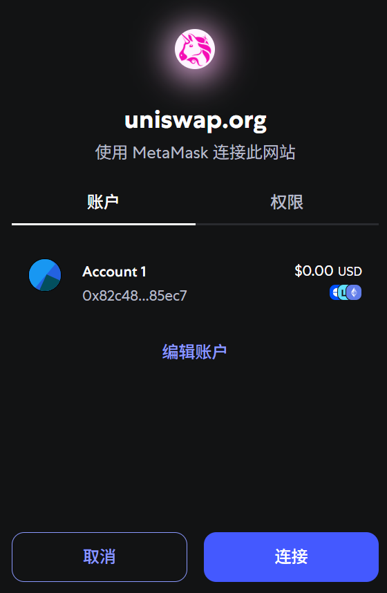

### 6. 发起交易 / 签名操作
常见三种弹窗操作：

#### 1. 转账交易
- 发送 ETH/BNB 等，填写接收地址和金额
- MetaMask 弹出「确认 Gas 费用」窗口
- 点击确认，交易进入链上执行

#### 2. 签署消息（如空投验证/NFT 抽奖）
- 常见为 signMessage 签名（不会转账）
- 用于验证钱包持有者或授权 DApp

#### 3. 授权操作（Approve / setApprovalForAll）
- 授权合约提取代币或 NFT
- 务必看清授权额度，避免“无限”授权

### 7. 安全使用建议
- 不泄露助记词/私钥
- 不点击空投链接，不随意签名陌生消息
- 常用 revoke.cash 清除危险授权
- 高价值资产建议用冷钱包（Ledger）

### 常见问题 FAQ

| 问题 | 解答 |
| ---- | ---- |
| 钱包余额显示为 0？ | 检查是否在正确链上（如在 BSC 上查 ETH 不会显示） |
| 无法连接 DApp？ | 检查网络选择，刷新页面或重连 |
| 交易卡住 Pending？ | 可提高 Gas 再发一笔替代，或等待区块确认 |
| 钱包被钓鱼怎么办？ | 立即转移资产至新钱包、撤销授权，并通知相关平台封锁合约 |

## 小结

MetaMask 是最基础也最强大的 Web3 钱包之一，熟练掌握以下 5 步即可应对大部分交互：

1. 创建/导入钱包
2. 添加网络
3. 添加代币
4. 连接 DApp
5. 发起签名/交易操作
