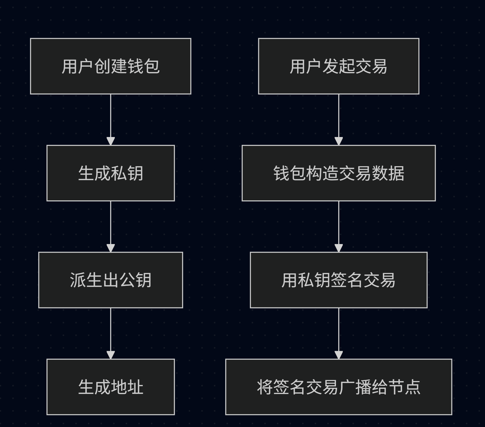

# Web3钱包
“你的私钥，你的币。你的钱包，你的自由。”

##  1. 钱包是什么？

钱包 ≠ 存币, 钱包是一个管理私钥的工具，你的资产都在链上，钱包用于：

- 管理私钥、公钥、地址
- 生成交易数据
- 对交易进行签名
- 与区块链交互

> 区块链资产始终在链上，钱包只是控制资产的钥匙。

## 2. 钱包的核心组成

| 组成部分 | 描述 |
| --- | --- |
| 私钥 | 64 位十六进制字符串，控制你资产的唯一凭证，**绝不可泄露** |
| 公钥 | 由私钥生成，对外公开，用于验证签名 |
| 地址 | 由公钥派生，是别人转账给你的“收款码” |
| 助记词 | 12/24 个英文单词，用于恢复私钥，便于记忆 |

##  3. 钱包的分类方式

### 1️⃣ 按是否联网：冷钱包 vs 热钱包

| 类型 | 描述 | 代表产品 |
| --- | --- | --- |
| 热钱包 | 联网，便捷，适合日常操作，安全性略低 | MetaMask、Trust Wallet |
| 冷钱包 | 私钥永不联网，物理隔离，适合大额长期持有 | Ledger、Trezor、OneKey |

- **冷钱包适合**：大额资产、长期持仓  
- **热钱包适合**：频繁交互、NFT mint、DeFi 交易

### 2️⃣ 按私钥控制权：自托管 vs 托管钱包

| 类型 | 私钥持有人 | 风险/优点 | 举例 |
| --- | --- | --- | --- |
| 自托管钱包 | 用户自己 | 真正“拥有资产”，安全性取决于你 | MetaMask、Phantom、Keplr |
| 托管钱包 | 平台持有 | 平台风险，易用但资产安全依赖平台 | 币安账户、OKX、Coinbase |

### 3️⃣ 按使用场景：通用 vs 应用钱包

| 类型 | 特点 | 代表 |
| --- | --- | --- |
| 通用钱包 | 支持多链、多资产类型 | Rabby、MetaMask、TokenPocket |
| 专用钱包 | 针对特定生态或应用定制 | Zapper（DeFi）、Argent（Layer2） |

##  4. 钱包工作原理（简图）

每次链上操作，本质都是<b>用私钥签名一笔数据并广播出去</b>。

## 5. 常见操作（以 MetaMask 为例）

| 操作 | 实现原理 |
| --- | --- |
| 创建钱包 | 随机生成私钥 + 助记词 |
| 导入钱包 | 通过私钥或助记词恢复账户 |
| 添加自定义链 | 配置 RPC、链 ID、代币符号等 |
| 确认交易（签名） | 对交易数据进行 ECDSA 签名 |
| 拒绝交易 | 不签名、不广播 |

## 6. 安全建议

- 助记词不要截图、拍照、存网盘，建议纸质离线保存
- 避免点击未知链接（防钓鱼签名/授权）
- 定期用 revoke.cash 等工具检查授权
- 设置 MetaMask 提示“签名前展示详情”
- 大额资产建议冷钱包 + 分散保管

## ✅ 小结

| 项目 | 自托管钱包（推荐） | 托管钱包（如交易所） |
| --- | --- | --- |
| 私钥掌控权 | 你自己 | 平台控制 |
| 安全性 | 高，但需自我保护 | 易用但有平台风险 |
| 功能 | 自由，支持 DeFi/NFT | 仅限平台范围 |
| 恢复方式 | 助记词/私钥 | 账号密码/邮箱 |
